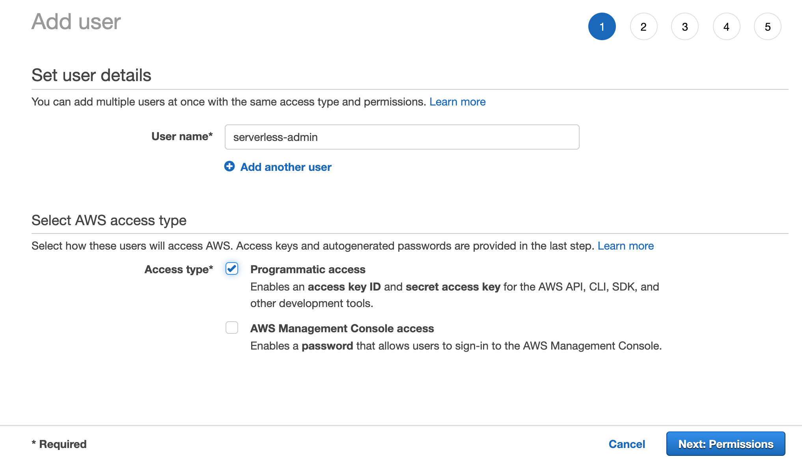
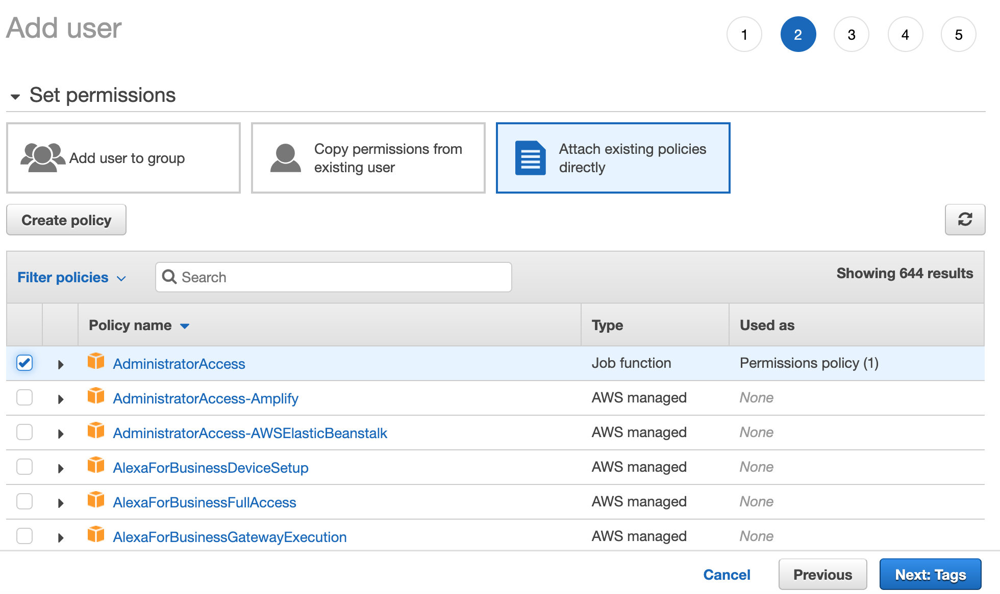
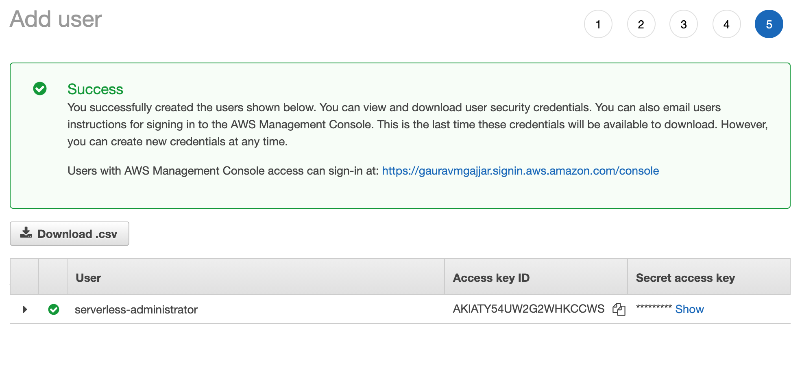

# Create User in AWS Console

1. Create a user `serverless-admin` in your AWS Console with Programmatic Access like below,

2. Now Attach an existing policy `AdministratorAccess` to the user

> NOTE: We've chose the policy only for test purposes so please update the policy or remove the policy after test is done as it not advised to give full access to the user. There

3. Skip adding tags or chose the tags you want

4. Review the user details carefully and create the user

5. The created user will be displayed with `Access key ID` and `Secret access key` like below,

Copy these `Access key ID` and `Secret access key` as it will be used for configuring Serverless
